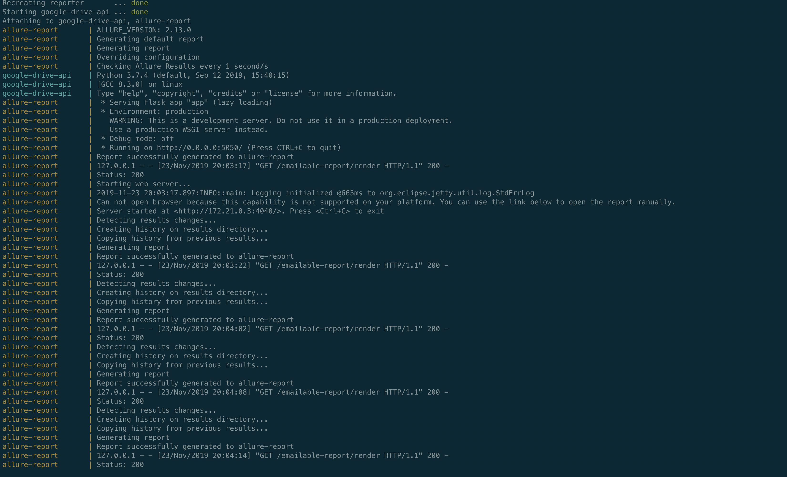
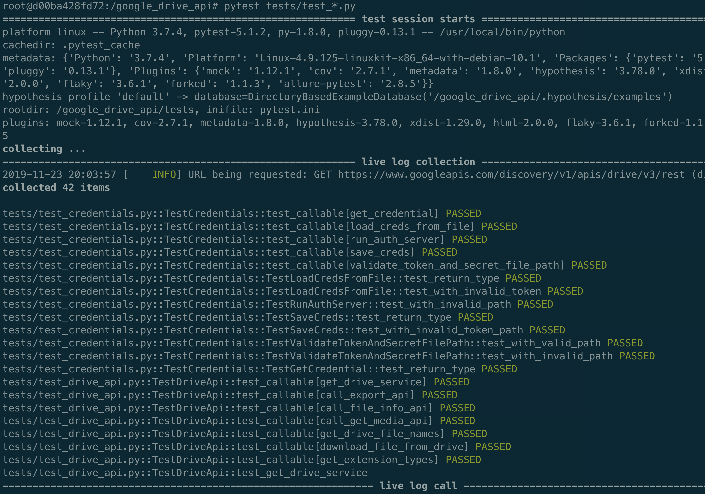
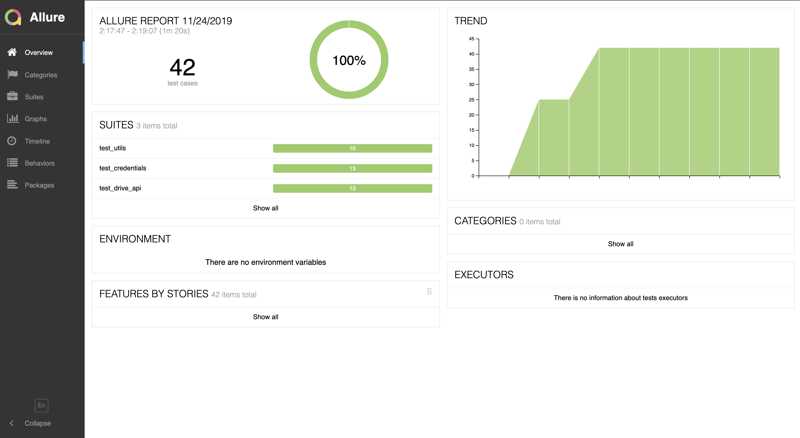
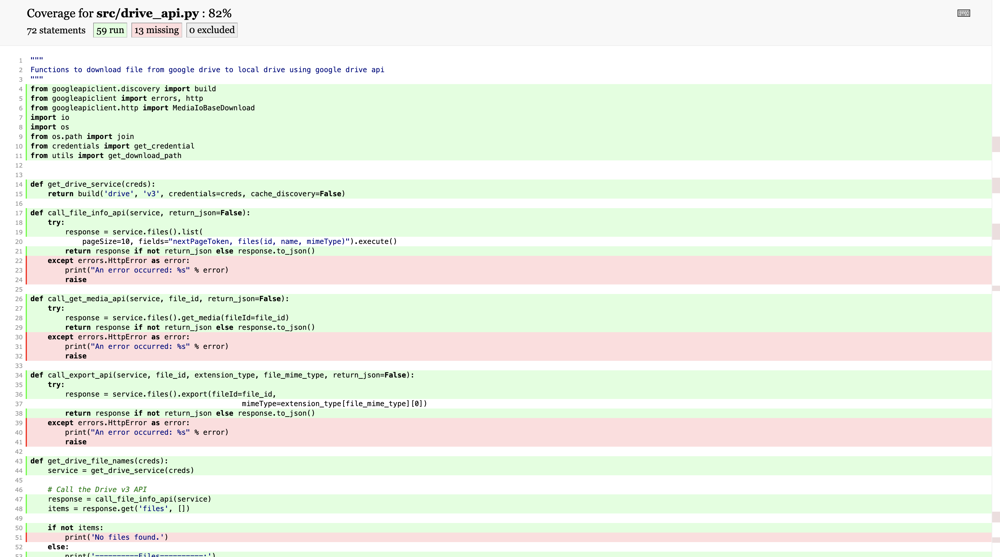

# Tests for Google Drive API
This project contains code all types of tests for testing file download from google drive to local folder using google drive api

## Project Structure Overview
```
|-- root(google_drive_api)
    |-- [+] src                     # main app code is here
    |-- [+] tests                   # tests are here
        |--  test_drive_api.py
        |--  test_credentials.py
        |--  test_utils
        |-- [+] htmlcov             # contains coverage report
        |-- [+] reports             # contains test report
        |-- [+] schemas             # response json schema 
        |-- conftest.py             # shares test fixtures
        |-- pytest.ini              # basic test configs
    |-- requirements.txt            # all app dependencies
    |-- docker-compose.yml          # to spawn containers
    |-- dockerfile                  # docker build file
```
## Steps to Run the project-

1. Install [`Docker`](https://docs.docker.com/docker-for-mac/install/):

2. Clone this repo and traverse to project directory
```sh
$ cd GOOGLE_DRIVE_API
```

3. Build and start the container using -
```sh
$ docker-compose up
```


4. Check the running container status using
```sh
$ docker ps
```
### To trigger download using `drive-api`:
Pre-requisite- Google `oauth2.0` `credentials` and `token` file are `required` to proceed further.

Make sure to obtain those files first and then pass their path as environment variable while executing below command

```sh
$ docker exec -ti google-drive-api token_path='/path/to/token.pickle' secret_path='/path/to/credentials.json' download_path='/path/to/download/folder/' python /google_drive_api/src/drive_api.py
```

### To run `tests`:
```sh
$ docker exec -ti google-drive-api pytest /google_drive_api/tests/test_utils.py
$ docker exec -ti google-drive-api pytest /google_drive_api/tests/test_drive_api.py
$ docker exec -ti google-drive-api pytest /google_drive_api/tests/test_credentials.py
```


### To view test run report:
Go to url http://localhost:4040



## Testing Approach
* The project has different types of tests written using [`pytest`](https://docs.pytest.org/en/latest/), a python based test framework.

* All the tests are written as mix of unit and integration covering the functional aspects of each module.

* Use of `mocking` and `patching` is done to isolate functions under test and generate error scenarios.

* `Test Data` is provided to the tests using a mix of `hardcode values`, `faker`

* `json schema validation` is implemented for api tests.

* The project uses file `conftest.py` to share `test data` in the form of `test fixtures` and `configuration` among all the tests.

* All the test run reports are stored a `reports` folder which is being pinged by the `allure-report` service continuously where the reports can be seen along with the previous history

* Keeping `Continuous Integration and Testing` in mind, entire project is `dockerized`. The docker containers can be configured to be spawned using tools like `jenkins` on code change to run tests.

* The test implementes following features as well:

    * [`pytest-xdist`](https://pypi.org/project/pytest-xdist/) to support parallel runs
    * [`code coverage`](https://pypi.org/project/pytest-cov/) report
    

    * `flaky` support to re-run tests n-times on failure

### Future Tasks-

* Add more tests of each category.
* Divide tests into categories like unit, functional
